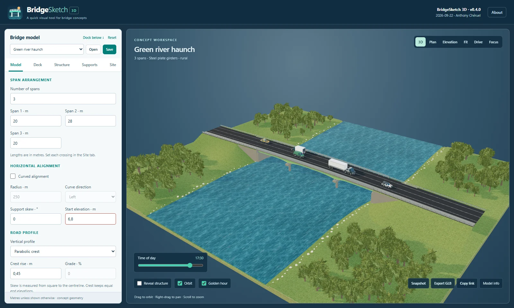
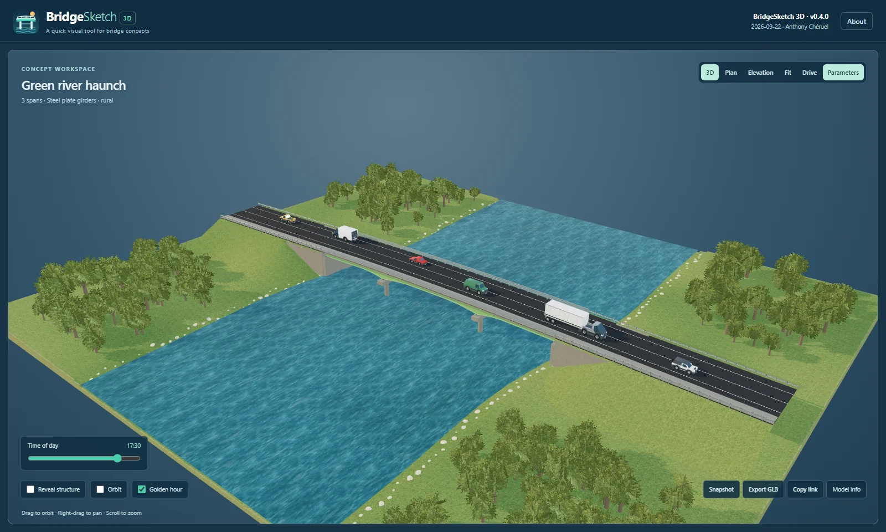
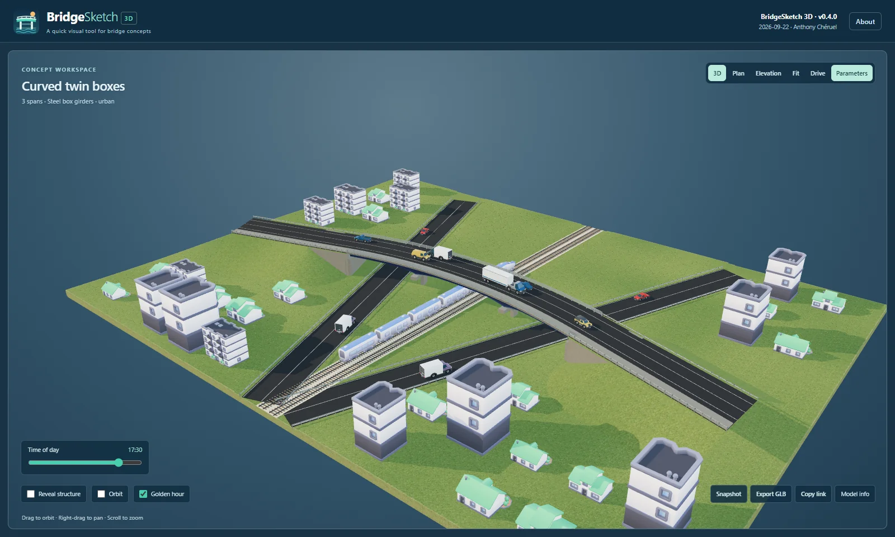
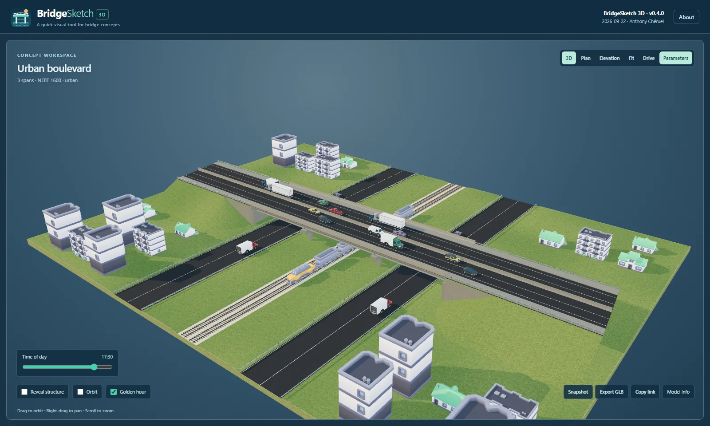
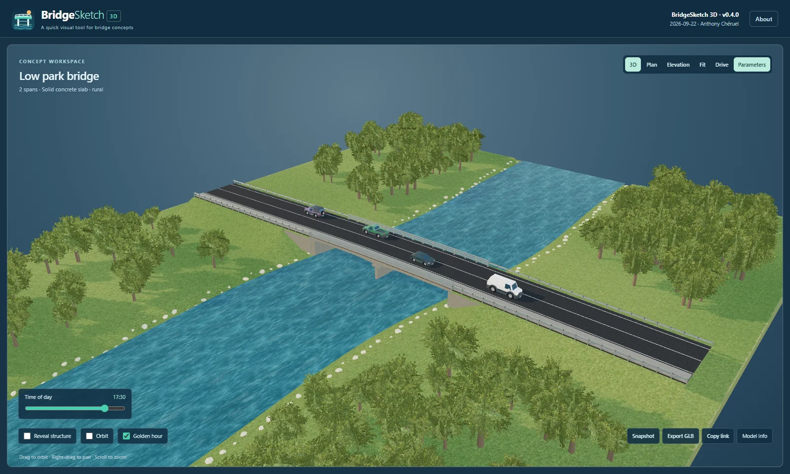
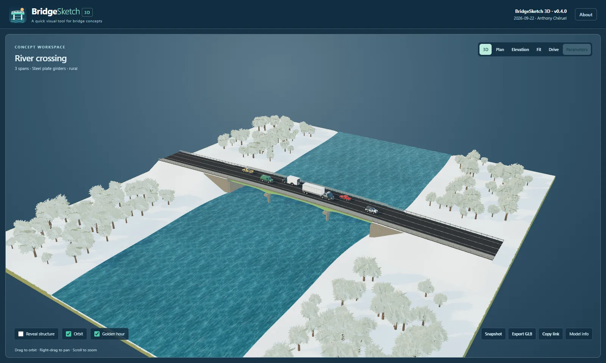

# BridgeSketch 3D

**A quick visual tool for bridge concepts** · Version 0.4.2 · 24 September 2026 · Anthony Chéruel

BridgeSketch 3D is a browser-based, interactive 3D bridge configurator. Set a span arrangement, road section, superstructure, supports and site, then explore the result from above, below or along the obstacle being crossed. It runs entirely from local files served by the included offline launcher, or as a static site on GitHub Pages. There is no account, backend, build step or runtime internet dependency.

## Try the included concepts

Select a concept at the top of the parameter panel. Every concept is editable; changing a parameter creates a custom concept. **Green river haunch** opens by default, with Orbit, Golden hour and moving traffic on.

| Concept | What it shows |
| --- | --- |
| Green river haunch | Three continuous green plate-girder spans, variable depth, river, sidewalk and steel railings |
| NEBT river crossing | Two precast concrete spans with generous shoulders |
| Curved twin boxes | Curved, variable-depth steel boxes over city roads and a railway |
| Low park bridge | Short, variable-depth solid concrete slab beside a river |
| Urban boulevard | Four lanes, concrete median, sidewalks and square-column bents |
| Weathered railway overpass | Skewed steel span with a weathered finish and return walls |

All curated concepts open with return walls. Wingwalls remain an editable option under **Supports**, with a selectable flare angle.

| Green river haunch | Curved twin boxes |
| --- | --- |
|  |  |
| **Urban boulevard** | **Low park bridge** |
|  |  |

## Shape the bridge

- **Model:** 1–8 spans, straight or curved alignment, skew, elevation, crest or constant grade. Each span can cross a road, railway or river.
- **Deck:** total width, 0–8 lanes (0 gives a pedestrian-only concrete surface), editable lane width, shoulders, median or island, and optional sidewalks. Choose concrete, 210A, 210C or 20C railing independently on each bridge side. Sidewalks can have an additional traffic-side steel or concrete barrier.
- **Structure:** metric NEBT concrete girders, steel plate girders, 1–14 hollow steel boxes with two 500 × 50 mm top flanges and inclined webs, or a solid concrete slab. Variable-depth steel and concrete girders and slabs can deepen at piers or, on a single span, at the abutments. A 400 mm constant-depth zone remains over the bearings. Painted steel includes the requested AMS-STD-595 brown, green, gray, three blues and red, plus weathered steel and custom hex input.
- **Supports:** column bents with round or square columns, editable bent cap width and centre/end depths, pier walls, hammerheads, profile-following backwalls and return walls, and adjustable wingwalls. Major concrete edges have 15 mm chamfers.
- **Site:** rural meadow or urban surroundings, grass or snow terrain, obstacle dimensions and clearance, 2H:1V approach embankments with optional stone-faced quarter cones and optional grass, stone or concrete slopes in front of the abutments. The approach reaches the model cut and its end is closed. Four locally bundled Kenney building types populate urban scenes.

The scene bundles CC0 [Poly Haven rough concrete](https://polyhaven.com/a/rough_concrete) and [rock ground](https://polyhaven.com/a/rock_ground) colour, normal and roughness maps, plus textured asphalt and meadow surfaces, river motion, HSS railings, roadside W-beam guardrails, skew-following steel bracing and seven [Kenney Car Kit](https://kenney.nl/assets/car-kit) vehicle styles. Three [Kenney Train Kit](https://kenney.nl/assets/train-kit) consists—diesel freight, bullet and city passenger—can be selected for railway crossings or mixed between crossings. Each railway crossing has one seeded 4–12-car train using the right-hand track for its direction of travel. Traffic visibility and motion sit beside **Reveal structure** at the lower left of the viewer.

## Explore and export

Drag to orbit, right-drag to pan and scroll to zoom. The **Time of day** slider covers 00:00–24:00 with a gradual dusk transition; **Golden hour** jumps to 17:30. The selected hour is saved with the bridge and included in share links. Use **3D**, **Plan**, **Elevation** or the station-adjustable **Section** view; **Fit** reframes the bridge. Section views can be saved as SVG. **Drive** travels along the road, railway or river beneath a middle span. Press **Escape** to return. **Reveal structure** hides the deck and concrete haunches, **Focus** expands the canvas, and **Dock below** moves the controls to the bottom.

**Save/Open** preserves the editable configuration as JSON. **Copy link** includes both parameters and the camera position. **Snapshot** exports a PNG with the selected background, and **Export GLB** creates a static 3D model. Shared localhost links require the recipient to run the offline server; a link from a published Pages site opens directly.

## Run offline

Download and extract the **offline** archive. On Windows, double-click `OPEN_OFFLINE.cmd` and keep its PowerShell window open, then visit [http://127.0.0.1:5174/](http://127.0.0.1:5174/). It uses Windows' built-in PowerShell web server; Node.js and an internet connection are not required. Do not open `index.html` as a `file://` URL, because browser module loading prevents that mode.

For local development from the source folder, run `node serve.mjs` and open [http://127.0.0.1:5173/](http://127.0.0.1:5173/).

## Publish on GitHub Pages

The [BridgeSketch 3D repository](https://github.com/ACFakkoh/BridgeSketch-3D) keeps the publishable static app at the root of **main**: `index.html`, `app.mjs`, `models/`, `textures/`, `vendor/`, screenshots and this README. No build command is needed. If **Settings → Pages** is set to **Deploy from a branch**, **main**, **/ (root)**, each push to main publishes the updated app at [ACFakkoh.github.io/BridgeSketch-3D](https://acfakkoh.github.io/BridgeSketch-3D/). A Pages deployment can take a few minutes; refresh after it completes. Relative asset paths also work under a repository URL. See [GITHUB_PAGES.md](GITHUB_PAGES.md) for first-time setup and updating.

The separate local source project keeps runtime files in `dist/`. To make matching offline and GitHub Pages archives after changing them, run `powershell -NoProfile -File .\package-release.ps1`. The packaging script preserves earlier release folders and refuses to overwrite an archive with the same version; use a new release version for subsequent builds.

## Check a source change

With Node.js 24 or newer, run `node check.mjs`. It checks configuration validation and round trips, actual structure geometry, embankment and scenery boundaries, traffic lane placement, curated presets and finite mesh data. For the offline launcher, run `OPEN_OFFLINE.ps1 -NoBrowser` and then `check-offline.ps1` in a second PowerShell window. Use a modern desktop browser with WebGL 2 and hardware acceleration for the 3D view.

## Scope and credits

BridgeSketch 3D is for concept visualization. It does not perform structural sizing, standards checks, hydraulic analysis or construction detailing. Clearances use a conservative whole-span estimate; site-specific road tie-ins and certified barrier details require engineering review.

The optional wingwall rendering remains an area for refinement; use return walls for presentation-ready concepts.

Vehicle geometry comes from **Kenney Car Kit 3.1**, released under [CC0 1.0](https://creativecommons.org/publicdomain/zero/1.0/), and is adapted and bundled for offline use. [Vehicle credits](models/VEHICLE_CREDITS.md) and [train/building credits](models/SCENE_CREDITS.md) include source links and retained licences. [Texture credits](textures/CREDITS.md) and [generated texture notes](textures/GENERATED.md) document the local surfaces; Three.js vendor notices are under `vendor/`.
